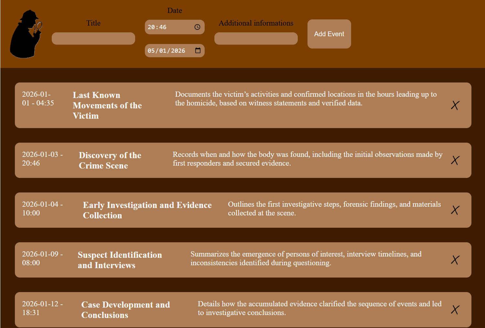

# Detective Timeline
A timeline for detective

## Logo


## Main Page


Made for Midnight 2026!

## Database
```SQL
CREATE DATABASE IF NOT EXISTS detectiveTimeline;
```

### Accounts
```SQL
+-----------------------+
|       accounts        |
+-----------------------+
| id | email | password |
+----+-------+----------+
|    |       |          |
|    |       |          |
|    |       |          |
+----+-------+----------+
```

```SQL
CREATE TABLE accounts (
    id int NOT NULL AUTO_INCREMENT,
    email TEXT NOT NULL,
    password TEXT NOT NULL,
    PRIMARY KEY (id)
);
```

### Timelines
```SQL
+-------------------------------+
|           timelines           |
+-------------------------------+
| id | accountId | title | date |
+----+-----------+-------+------+
|    |           |       |      |
|    |           |       |      |
|    |           |       |      |
+----+-----------+-------+------+
```

```SQL
CREATE TABLE timelines (
    id int NOT NULL AUTO_INCREMENT,
    accountId int NOT NULL,
    title TEXT NOT NULL,
    date DATE NOT NULL,
    PRIMARY KEY (id),
    FOREIGN KEY (accountId) REFERENCES accounts(id)
);
```

### Events
```SQL
+----------------------------------------------+
|                     events                   |
+----------------------------------------------+
| id | timelineId | title | date | description |
+----+------------+-------+------+-------------+
|    |            |       |      |             |
|    |            |       |      |             |
|    |            |       |      |             |
+----+------------+-------+------+-------------+
```

```SQL
CREATE TABLE events (
    id int NOT NULL AUTO_INCREMENT,
    timelineId int NOT NULL,
    title TEXT NOT NULL,
    date DATETIME NOT NULL,
    description TEXT,
    PRIMARY KEY (id),
    FOREIGN KEY (timelineId) REFERENCES timelines(id)
);
```